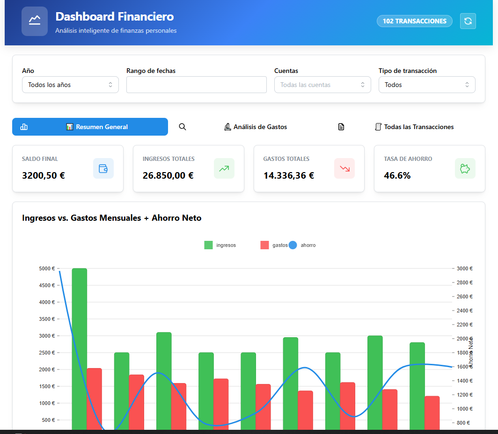
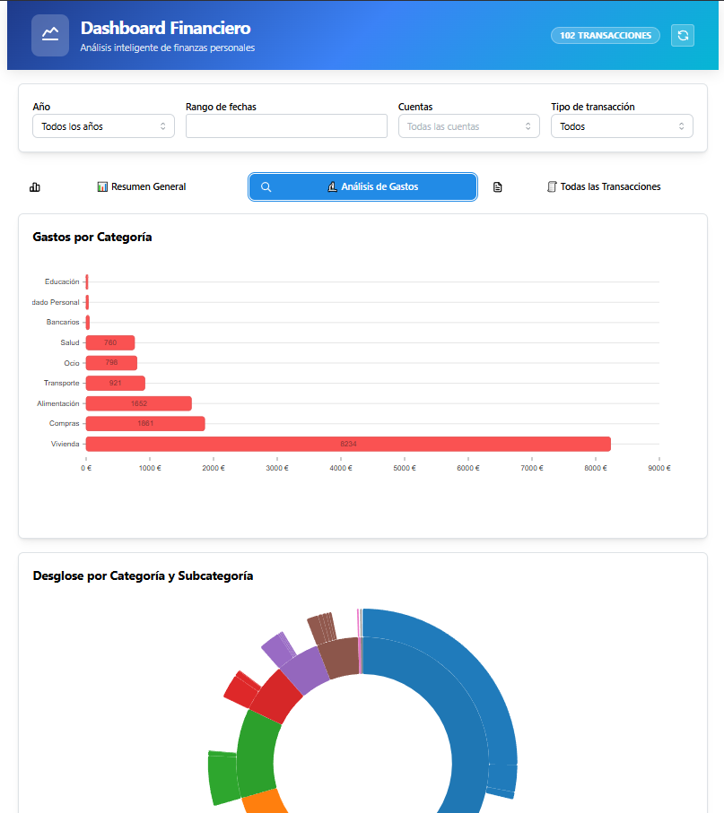
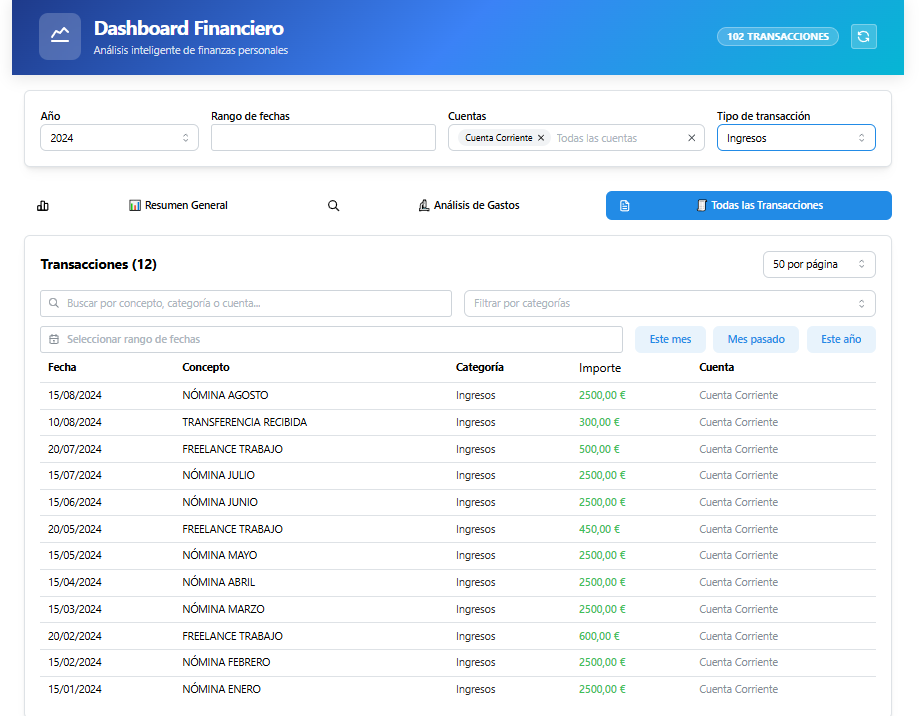

# 📊 Dashboard Financiero Personal

Una aplicación web moderna y completa para el análisis de finanzas personales construida con React, TypeScript y Mantine UI. Permite cargar, analizar y visualizar movimientos bancarios de forma intuitiva y profesional, organizados en pestañas especializadas con un diseño profesional y optimizado.


## 📸 Capturas de Pantalla

### 🗂️ Vista General con Pestañas
*Interfaz principal del dashboard mostrando la organización por pestañas y el header profesional*



### 📊 Pestaña Resumen General
*Dashboard principal con KPIs, gráficos combinados y evolución del saldo*



### 🔬 Pestaña Análisis de Gastos
*Análisis detallado con gráficos por categorías, sunburst y mapa de calor*



## ✨ Características Principales

### 🎨 **Diseño Profesional**
- **Header Moderno**: Gradiente azul profesional con efectos glass morphism y backdrop blur
- **Footer Informativo**: Enlaces útiles, información de copyright y detalles del proyecto
- **Layout Responsive**: Diseño optimizado para todas las pantallas con altura completa
- **Iconografía Consistente**: Tabler Icons en toda la aplicación
- **Estética Moderna**: Uso de gradientes, sombras y efectos visuales profesionales

### ⚡ **Optimizaciones de Rendimiento**
- **Límites Inteligentes**: Los gráficos se limitan automáticamente a 36 meses (3 años) para mejor legibilidad cuando hay grandes volúmenes de datos
- **Feedback Visual**: Indicadores informativos cuando se aplican limitaciones de datos mostrando "X de Y meses totales"
- **Mapa de Calor Optimizado**: Limitado a 3 años para evitar problemas de rendimiento y sobrecarga visual
- **Carga Eficiente**: Procesamiento optimizado de grandes datasets con filtrado inteligente
- **Memoria Optimizada**: useMemo estratégico para evitar recálculos innecesarios

### 🗂️ **Organización por Pestañas**rd Financiero Personal

Una aplicación web moderna y completa para el análisis de finanzas personales construida con React, TypeScript y Mantine UI. Permite cargar, analizar y visualizar movimientos bancarios de forma intuitiva y profesional, organizados en pestañas especializadas.


## ✨ Características Principales

### �️ **Organización por Pestañas**
La aplicación está estructurada en tres pestañas principales que proporcionan diferentes perspectivas de análisis:

#### 📊 **Pestaña 1: Resumen General**
*Vista principal que responde a "¿Cómo voy?"*
- **Tarjetas KPI**: Saldo actual, Ingresos, Gastos y Ahorro del período
- **Gráfico Ingresos vs Gastos**: Barras mensuales con línea de ahorro superpuesta y leyenda horizontal optimizada en la parte superior
- **Evolución del Saldo**: Línea temporal del balance financiero por mes con optimización automática para grandes datasets

#### 🔬 **Pestaña 2: Análisis de Gastos**
*Dedicada a responder "¿En qué y cuándo gasto mi dinero?"*
- **Gastos por Categoría**: Gráfico de barras horizontales de principales gastos
- **Evolución Mensual por Categoría**: Análisis temporal con selector múltiple de categorías para comparativas
- **Desglose por Categoría y Subcategoría**: Gráfico de barras agrupadas que muestra el importe por subcategoría dentro de cada categoría, facilitando la comparación visual y el análisis detallado.
- **Mapa de Calor Calendario**: Patrones de gasto diarios para identificar tendencias (optimizado para 3 años)

#### 🧾 **Pestaña 3: Todas las Transacciones**
*Herramienta completa de exploración de datos*
- **Tabla Completa**: Con todos los filtros, ordenación y funcionalidades
- **Espacio Optimizado**: Diseñada para visualización óptima en cualquier pantalla
- **Análisis Detallado**: Acceso granular a cada transacción

### 🎛️ **Filtros Globales**
Los filtros principales (rango de fechas, selector de cuentas, etc.) están ubicados **fuera** del componente de pestañas, aplicándose a todas las vistas simultáneamente para mantener una experiencia de análisis consistente.

### � **Visualizaciones Avanzadas**
- **Gráficos Combinados**: Barras e líneas superpuestas para análisis multi-dimensional
- **Leyendas Optimizadas**: Posicionamiento horizontal en la parte superior para mejor aprovechamiento del espacio
- **Interactividad**: Tooltips detallados con formato de moneda española
- **Responsividad**: Adaptación automática a diferentes tamaños de pantalla
- **Animaciones**: Transiciones suaves con Nivo para mejor UX
- **Rendimiento Inteligente**: Limitación automática de datos para mantener legibilidad en gráficos con muchos puntos

### 🔍 **Sistema de Filtros Avanzado**
- **Búsqueda Global**: Debounced search por concepto, categoría y cuenta
- **Filtros de Categoría**: MultiSelect con búsqueda y selección múltiple
- **Rangos de Fecha**: DatePicker con presets rápidos (este mes, mes pasado, este año)
- **Ordenamiento**: Clickeable por importe (ascendente/descendente/sin orden)
- **Badges Activos**: Indicadores visuales de filtros aplicados con eliminación individual
- **Reset Completo**: Botón para limpiar todos los filtros de una vez

### 📋 **Tabla de Transacciones Profesional**
- **Paginación Inteligente**: 25, 50, 100, 200 registros por página
- **Claves Únicas**: Sistema robusto para evitar warnings de React
- **Formato de Moneda**: Visualización en euros con formato español
- **Responsive**: Adaptable a diferentes tamaños de pantalla
- **Performance**: Optimizada para manejar miles de transacciones

### 📊 **KPIs y Métricas**
- **Balance Total**: Saldo actual de todas las cuentas
- **Ingresos del Periodo**: Total de entradas en el rango seleccionado
- **Gastos del Periodo**: Total de salidas en el rango seleccionado
- **Ahorro Neto**: Diferencia entre ingresos y gastos
- **Indicadores Visuales**: Iconos y colores intuitivos para cada métrica

## 🛠️ Stack Tecnológico

### **Frontend**
- **React 19.1.1** - Framework moderno con las últimas características
- **TypeScript 5.8.3** - Tipado estático para mayor robustez
- **Vite 7.1.2** - Build tool ultrarrápido y servidor de desarrollo

### **UI/UX**
- **Mantine UI 8.2.4** - Librería de componentes moderna y completa
  - `@mantine/core` - Componentes base
  - `@mantine/dates` - Selectores de fecha avanzados
  - `@mantine/hooks` - Hooks útiles para React
- **Tabler Icons** - Iconografía profesional y consistente

### **Visualización de Datos**
- **Nivo 0.99.0** - Suite completa de gráficos interactivos
  - `@nivo/line` - Gráficos de línea
  - `@nivo/bar` - Gráficos de barras
  - `@nivo/pie` - Gráficos circulares y donut
  - `@nivo/calendar` - Mapas de calor de calendario
  - `@nivo/sunburst` - Gráficos jerárquicos Sunburst

### **Estado y Datos**
- **Zustand 5.0.7** - Gestión de estado ligera y eficiente
- **Papa Parse 5.5.3** - Procesamiento robusto de archivos CSV
- **date-fns 4.1.0** - Manipulación y formateo de fechas

## 🚀 Inicio Rápido

### **Prerrequisitos**
- Node.js 18+ 
- npm o yarn
- **Docker** (para despliegue con contenedores)

### **Método 1: Instalación Tradicional**

1. **Clona el repositorio**:
```bash
git clone https://github.com/danizd/dashboard-movimientos-bancarios.git
cd dashboard-movimientos-bancarios
```

2. **Instala las dependencias**:
```bash
npm install
```

3. **Inicia el servidor de desarrollo**:
```bash
npm run dev
```

4. **Abre tu navegador en**: `http://localhost:5173`

### **Método 2: Despliegue con Docker (Recomendado para Producción)**

#### **🐳 Opción A: Docker Compose (Más Simple)**
```bash
# Clona el repositorio
git clone https://github.com/danizd/dashboard-movimientos-bancarios.git
cd dashboard-movimientos-bancarios

# Ejecuta con Docker Compose
docker-compose up -d

# Accede a http://localhost:3000
```

#### **🛠️ Opción B: Scripts Automatizados**

**En Linux/macOS:**
```bash
# Hacer ejecutable el script
chmod +x docker-deploy.sh

# Despliegue completo
./docker-deploy.sh deploy

# O comandos individuales
./docker-deploy.sh build    # Solo construir
./docker-deploy.sh run      # Solo ejecutar
./docker-deploy.sh status   # Ver estado
```

**En Windows:**
```cmd
# Despliegue completo
docker-deploy.bat deploy

# O comandos individuales
docker-deploy.bat build     # Solo construir
docker-deploy.bat run       # Solo ejecutar
docker-deploy.bat status    # Ver estado
```

#### **🔧 Opción C: Docker Manual**
```bash
# Construir imagen
docker build -t dashboard-financiero:latest .

# Ejecutar contenedor
docker run -d -p 3000:80 --name dashboard-financiero dashboard-financiero:latest

# Accede a http://localhost:3000
```

### **Comandos Disponibles**

#### **Desarrollo Local**
```bash
# Desarrollo
npm run dev          # Servidor de desarrollo con hot reload

# Producción
npm run build        # Build optimizado para producción
npm run preview      # Preview del build de producción

# Calidad de Código
npm run lint         # Ejecuta ESLint para verificar código
```

#### **Docker**
```bash
# Docker Compose (Recomendado)
docker-compose up -d        # Ejecutar en background
docker-compose up           # Ejecutar con logs
docker-compose down         # Parar contenedores
docker-compose logs -f      # Ver logs en tiempo real

# Scripts Automatizados
# Linux/macOS
./docker-deploy.sh deploy   # Despliegue completo
./docker-deploy.sh status   # Estado del contenedor
./docker-deploy.sh logs     # Ver logs
./docker-deploy.sh clean    # Limpiar recursos

# Windows
docker-deploy.bat deploy    # Despliegue completo
docker-deploy.bat status    # Estado del contenedor
docker-deploy.bat logs      # Ver logs
docker-deploy.bat clean     # Limpiar recursos

# Makefile (Linux/macOS)
make up                     # Ejecutar con compose
make build                  # Solo construir imagen
make logs                   # Ver logs
make clean                  # Limpiar recursos
```

## 📁 Estructura del Proyecto

```
src/
├── components/
│   ├── Dashboard/
│   │   ├── TabbedDashboardView.tsx    # Componente principal con pestañas
│   │   ├── OverviewTab.tsx            # Pestaña 1: Resumen General
│   │   ├── ExpensesAnalysisTab.tsx    # Pestaña 2: Análisis de Gastos
│   │   ├── TransactionsTable.tsx      # Pestaña 3: Todas las Transacciones
│   │   ├── KpiCards.tsx               # Tarjetas de métricas (KPIs)
│   │   ├── Filters.tsx                # Controles de filtrado globales
│   │   ├── ChartsGrid.tsx             # Grid legacy (mantenido por compatibilidad)
│   │   └── DashboardView.tsx          # Vista legacy (mantenida por compatibilidad)
│   ├── FileUploader/
│   │   └── FileUploader.tsx           # Componente de carga de archivos
│   └── Layout/
│       └── Layout.tsx                 # Layout principal con header
├── store/
│   └── financialStore.ts              # Estado global con Zustand
├── types/
│   └── transaction.ts                 # Tipos TypeScript
├── utils/
│   └── csvParser.ts                   # Utilidades para procesar CSV
├── main.tsx                           # Punto de entrada de la aplicación
│
├── docker/                            # Configuración Docker
│   ├── Dockerfile                     # Imagen Docker multi-stage
│   ├── docker-compose.yml             # Orquestación de servicios
│   ├── nginx.conf                     # Configuración Nginx optimizada
│   ├── .dockerignore                  # Archivos excluidos del build
│   ├── docker-deploy.sh               # Script automatizado Linux/macOS
│   ├── docker-deploy.bat              # Script automatizado Windows
│   └── Makefile                       # Comandos simplificados
```

### **Arquitectura de Componentes**

#### **🗂️ TabbedDashboardView**
Componente principal que orquesta las pestañas y mantiene los filtros globales fuera de las pestañas para consistencia entre vistas.

#### **📊 OverviewTab**
- Incluye `KpiCards` para métricas principales
- Gráfico combinado de ingresos vs gastos con línea de ahorro
- Evolución mensual del saldo

#### **🔬 ExpensesAnalysisTab**
- Gastos por categoría (barras horizontales)
- Gráfico de barras agrupadas por categoría y subcategoría (sustituye al Sunburst para mayor claridad)
- Mapa de calor de calendario para patrones de gasto

#### **🧾 TransactionsTable**
- Tabla completa con filtros avanzados
- Optimizada para visualización y exploración de datos
- Sistema de paginación y ordenamiento inteligente

## 📊 Formato de Datos CSV

El dashboard espera archivos CSV con las siguientes columnas:

| Columna | Descripción | Formato | Ejemplo |
|---------|-------------|---------|---------|
| `Fecha contable` | Fecha de la transacción | DD-MM-YYYY | 15-08-2025 |
| `Fecha valor` | Fecha valor de la operación | DD-MM-YYYY | 15-08-2025 |
| `Concepto` | Descripción de la transacción | Texto | Compra en supermercado |
| `Importe` | Cantidad de la transacción | Decimal (,) | -25,50 |
| `Moneda` | Divisa | Texto | EUR |
| `Saldo` | Saldo después de la operación | Decimal (,) | 1.234,56 |
| `Concepto ampliado` | Descripción extendida | Texto | Detalles adicionales |
| `Categoria` | Categoría de la transacción | Texto | Alimentación |
| `Subcategoria` | Subcategoría | Texto | Supermercado |
| `cuenta` | Cuenta bancaria | Texto | Cuenta Corriente |

### **Características del Parser CSV**
- ✅ **Delimitador**: Punto y coma (;)
- ✅ **Decimal**: Coma (,) 
- ✅ **Encoding**: UTF-8
- ✅ **Headers**: Primera fila como nombres de columna
- ✅ **Validación**: Filtrado automático de filas inválidas
- ✅ **Ordenamiento**: Por fecha (más reciente primero)
- ✅ **Formatos de Fecha**: Soporte para DD/MM/YYYY y DD-MM-YYYY
- ✅ **Robustez**: Manejo de errores y validación de datos

## 🎨 Características de UX/UI

### **🗂️ Navegación por Pestañas**
- **Persistencia de Filtros**: Los filtros globales se mantienen al cambiar entre pestañas
- **Iconografía Intuitiva**: Cada pestaña tiene íconos descriptivos y emojis para fácil identificación
- **Diseño de Pills**: Pestañas con estilo moderno y redondeado
- **Carga Lazy**: Los componentes de cada pestaña se cargan según necesidad

### **📊 Experiencia de Análisis**
- **Flujo Lógico**: Desde vista general → análisis específico → datos detallados
- **Consistencia Visual**: Paleta de colores y formatos unificados entre pestañas
- **Tooltips Contextuales**: Información detallada al hacer hover en gráficos
- **Responsive**: Cada pestaña optimizada para diferentes tamaños de pantalla

### **🎯 Casos de Uso por Pestaña**

#### **📊 Resumen General**
*"¿Cómo voy financieramente?"*
- Revisión rápida del estado actual
- Identificación de tendencias principales
- Comparativa ingresos vs gastos mensual

#### **🔬 Análisis de Gastos**
*"¿En qué y cuándo gasto mi dinero?"*
- Identificación de categorías problemáticas
- Análisis de patrones temporales de gasto
- Desglose jerárquico detallado

#### **🧾 Todas las Transacciones**
*"¿Qué operaciones específicas he realizado?"*
- Búsqueda y filtrado granular
- Auditoría de movimientos específicos
- Exportación y análisis detallado

### **Diseño Responsive**
- **Desktop First**: Optimizado para pantallas grandes
- **Centrado**: Layout con máximo 1280px para legibilidad óptima
- **Full Width**: Gráficos que aprovechan todo el ancho disponible
- **Mobile Friendly**: Adaptable a dispositivos móviles

### **Interactividad Avanzada**
- **Tooltips Informativos**: Hover sobre gráficos muestra detalles
- **Filtros en Tiempo Real**: Actualizaciones instantáneas
- **Feedback Visual**: Estados de carga, errores y éxito
- **Navegación Intuitiva**: Controles familiares y accesibles

### **Paleta de Colores**
- **Ingresos**: Verde (#40c057)
- **Gastos**: Rojo (#fa5252)
- **Información**: Azul (#228be6)
- **Advertencias**: Naranja (#fd7e14)
- **Neutro**: Gris (#868e96)

## 🔧 Configuración y Personalización

### **Personalizar Categorías**
Las categorías se extraen automáticamente del CSV, pero puedes personalizarlas editando el parser en `src/utils/csvParser.ts`.

### **Añadir Nuevos Gráficos**
Para agregar visualizaciones:
1. Instala componentes de Nivo si es necesario
2. Añade la lógica de datos en `ChartsGrid.tsx`
3. Implementa el componente del gráfico

### **Modificar KPIs**
Los indicadores se calculan en `KpiCards.tsx` basándose en el estado filtrado.

## 🚀 Despliegue

### **🐳 Docker (Recomendado)**

#### **Despliegue Rápido**
```bash
# Usando Docker Compose (más simple)
docker-compose up -d

# Usando scripts automatizados
# Linux/macOS
./docker-deploy.sh deploy

# Windows
docker-deploy.bat deploy

# Acceder a http://localhost:3000
```

#### **Características del Contenedor Docker**
- ✅ **Multi-stage build** para optimizar tamaño
- ✅ **Nginx optimizado** para SPAs con configuración de cache
- ✅ **Health checks** automáticos
- ✅ **Compresión gzip** habilitada
- ✅ **Headers de seguridad** configurados
- ✅ **Logs estructurados** para monitoreo
- ✅ **Auto-restart** en caso de fallos

#### **Configuraciones Docker Disponibles**

**docker-compose.yml:**
- Configuración lista para producción
- Health checks automáticos
- Restart policies configuradas
- Networks aisladas
- Volúmenes para persistencia futura

**Scripts de automatización:**
- `docker-deploy.sh` (Linux/macOS) con logging colorizado
- `docker-deploy.bat` (Windows) con comandos equivalentes
- `Makefile` con comandos simplificados

### **☁️ Plataformas Cloud**

#### **Vercel**
```bash
npm run build
npx vercel --prod
```

#### **Netlify**
```bash
npm run build
# Sube la carpeta dist/
```

#### **Docker en Producción**
```bash
# Construir para producción
docker build -t dashboard-financiero:production .

# Ejecutar en servidor
docker run -d \
  --name dashboard-prod \
  --restart unless-stopped \
  -p 80:80 \
  dashboard-financiero:production
```

#### **AWS ECS / Google Cloud Run**
El contenedor Docker está optimizado para plataformas cloud:
- Imagen ligera basada en Alpine Linux
- Puerto 80 expuesto
- Health checks configurados
- Logs estructurados para CloudWatch/Cloud Logging

## 🤝 Contribuciones

Las contribuciones son bienvenidas. Para contribuir:

1. Fork el proyecto
2. Crea una rama para tu feature (`git checkout -b feature/AmazingFeature`)
3. Commit tus cambios (`git commit -m 'Add AmazingFeature'`)
4. Push a la rama (`git push origin feature/AmazingFeature`)
5. Abre un Pull Request

## 📝 Roadmap

### **Próximas Características**
- [ ] **Exportación de Reportes**: PDF y Excel con datos de cada pestaña
- [ ] **Comparativas Personalizadas**: Selección de períodos específicos
- [ ] **Presupuestos**: Gestión de presupuestos por categoría con alertas
- [ ] **Predicciones**: Proyecciones de gastos basadas en histórico
- [ ] **Múltiples Bancos**: Soporte para diferentes formatos CSV
- [ ] **Sincronización**: Conexión directa con APIs bancarias

### **Mejoras de UX/UI**
- [ ] **Personalización**: Configuración de vista por defecto en pestañas
- [ ] **Dashboards Personalizados**: Drag & drop de widgets
- [ ] **Temas**: Múltiples esquemas de color
- [ ] **Tutoriales**: Onboarding interactivo

### **Mejoras Técnicas**
- [ ] **Tests**: Suite de testing completa con Jest y Testing Library
- [ ] **PWA**: Aplicación web progresiva con offline support
- [ ] **Dark Mode**: Tema oscuro completo
- [ ] **i18n**: Soporte multiidioma (inglés, catalán)
- [ ] **Performance**: Lazy loading y virtualización para tablas grandes

## 📋 Changelog

### **v2.2.0** (Agosto 2025) - **Dockerización Completa**
- 🐳 **NUEVO**: Dockerización completa de la aplicación
  - Dockerfile multi-stage optimizado con Nginx y Alpine Linux
  - docker-compose.yml con health checks y auto-restart
  - Configuración Nginx optimizada para SPAs con cache y compresión
  - Scripts de automatización para Linux/macOS (docker-deploy.sh) y Windows (docker-deploy.bat)
  - Makefile con comandos simplificados
  - .dockerignore optimizado para builds eficientes
- ☁️ **NUEVO**: Preparación para despliegue en cloud
  - Imagen optimizada para AWS ECS, Google Cloud Run
  - Health checks configurados para load balancers
  - Logs estructurados para monitoreo en cloud
  - Puerto 80 expuesto y configuración de producción lista
- 🔧 **MEJORADO**: Documentación completa de Docker en README
  - Múltiples métodos de despliegue (Compose, scripts, manual)
  - Comandos disponibles para todos los sistemas operativos
  - Guías de despliegue en diferentes plataformas cloud
### **v2.1.0** (Agosto 2025) - **Diseño Profesional y Optimizaciones**
- 🎨 **NUEVO**: Header profesional con gradiente y efectos glass morphism
- 🦶 **NUEVO**: Footer informativo con enlaces y copyright
- 📊 **MEJORADO**: Leyendas horizontales en gráficos combinados para mejor aprovechamiento del espacio
- ⚡ **NUEVO**: Optimizaciones de rendimiento para datasets grandes
  - Limitación automática a 36 meses en gráficos temporales
  - Limitación a 3 años en mapas de calor de calendario
  - Feedback visual cuando se aplican limitaciones
- 🔧 **MEJORADO**: Parser CSV con soporte para múltiples formatos de fecha (DD/MM/YYYY y DD-MM-YYYY)
- 🎯 **MEJORADO**: Layout responsive con altura completa y espaciado optimizado
- 💫 **MEJORADO**: Efectos visuales y estética profesional en toda la aplicación

### **v2.0.0** (Agosto 2025) - **Nueva Arquitectura de Pestañas**
- 🗂️ **NUEVA**: Arquitectura de pestañas especializadas
  - 📊 Pestaña "Resumen General" con KPIs y gráficos principales
  - 🔬 Pestaña "Análisis de Gastos" con Sunburst y mapa de calor
  - 🧾 Pestaña "Todas las Transacciones" dedicada exclusivamente a datos
- 🎯 **MEJORADO**: Filtros globales aplicados a todas las pestañas
- 📈 **NUEVO**: Gráfico Sunburst jerárquico para categorías/subcategorías
- 🔄 **MEJORADO**: Experiencia de usuario más intuitiva y organizada
- 💫 **NUEVO**: Animaciones y transiciones mejoradas entre pestañas

### **v1.0.0** (Agosto 2025) - **Lanzamiento Inicial**
- ✨ Dashboard completo con 7 tipos de gráficos
- 🔍 Sistema de filtros avanzado con búsqueda debounced
- 📊 Tabla de transacciones con ordenamiento y paginación
- 🎨 Interfaz responsive centrada en 1280px
- 🏷️ Badges de filtros activos con eliminación individual
- 📅 Presets de fecha (este mes, mes pasado, este año)
- 🔧 Parsing robusto de CSV con validación de datos
- ⚡ Performance optimizada con React 19 y Zustand

## 📄 Licencia

Este proyecto está bajo la Licencia MIT. Ver el archivo `LICENSE` para más detalles.

## 👨‍💻 Autor

**Daniel** - [@danizd](https://github.com/danizd)

## 🙏 Agradecimientos

- [Mantine UI](https://mantine.dev/) - Por la excelente librería de componentes
- [Nivo](https://nivo.rocks/) - Por los gráficos interactivos
- [React](https://reactjs.org/) - Por el framework robusto
- [Vite](https://vitejs.dev/) - Por la herramienta de build ultrarrápida

---

⭐ **¡Si te gusta este proyecto, no olvides darle una estrella!** ⭐

## 📦 Otros proyectos en el repositorio

En la carpeta raíz encontrarás también la aplicación **Clasifica_movimientos_bancarios**, una herramienta complementaria para la clasificación automática de movimientos bancarios. Consulta su propio README para más detalles y uso específico.

---

⭐ **¡Si te gusta este proyecto, no olvides darle una estrella!** ⭐
